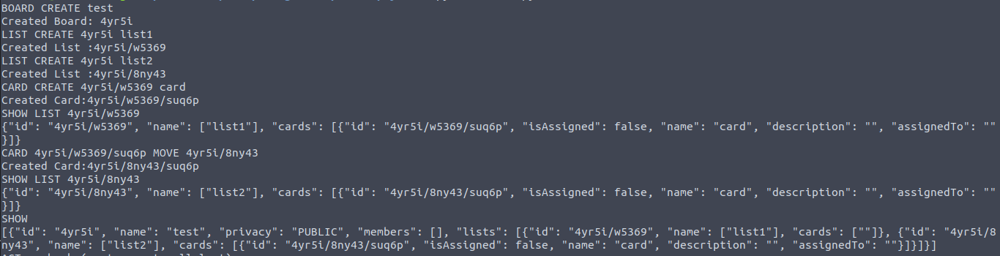

## Detailed Approach

- ID's for rach object are created such that it represents a path. e.g. If a `Board`(id: `abc12`) contains a `List` then the list ID will be `{boardId}/{listInstanceId}` (for instance, `abc12/c4ed5`). And a `Card` inside that list will have an ID `{boardId}/{listInstanceId}/{cardInstanceId}` (for instance, `abc12/c4ed5/l0ki9`).
  - This way the lookup to each object is always O(1). Since there only three levels in the heirarchy, the lookup time will always be constant.
  - Due to the visibility of a card inside a list and a list inside a board. The list can't be directly from outside without knowing the `boardId`. Hence adds to the privacy and security aspect.

### `class Trello`

- Attribute `boards` (dictionary) stores all the boards in the app. Key is `boardId` and value is corresponding `Board` instance. Dictionary helps in O(1) lookup time for all objects.
- Attribute`users` (dictionary) stores all the users in the app. Key is `userId` and value is corresponding `User` instance.
- Attribute `IDLENGTH` (int) specifies the length of ID generated by the `generateId()` method.
- Method `handleBoard` handles all the commands including `BOARD`. These include
  - BOARD CREATE
  - BOARD DELETE
  - BOARD ADD_MEMBER
  - BOARD REMOVE_MEMBER
  - BOARD name
  - BOARD privacy
- Method `handleList` handles all the command including `LIST`. These include
  - LIST CREATE
  - LIST DELETE
  - LIST name
- Method `handleCard` handles all the commands including `CARD`. These include
  - CARD CREATE
  - CARD DELETE
  - CARD name
  - CARD description
  - CARD ASSIGN
  - CARD UNASSIGN
  - CARD MOVE (Deletes the card from old list, updates the ID and creates the same card in new list)
- Method `handleShow` handles all the commands including `SHOW`. These include
  - SHOW
  - SHOW BOARD
  - SHOW LIST
  - SHOW CARD
- Method `cardNotFound(id)` raises an alert if the card specified in the id is not found.
- Method `getCardFromCardId(id)` retrieves the `Card` instance from `cardId`.
- Method `createBoard(id,name)` creates a new `Board` instance and adds it to `self.boards`
- Method `generateId(prefix)` creates a randomly generated ID by adding the prefix as `{prefix}/{generatedID}` and returns thsi new ID.
- Method `boardIdExists(id)` returns `True` if `id` exists in `self.boards` else returns `False`.
- Method `userExists(id)` returns `True` if `id` exists in `self.users` else returns `False`.
- Method `jsonify` returns JSON string of `Trello` instance.

### `class Board`

- Attribute `id` is `boardId`.
- Attribute `name` is board's name.
- Attribute `privacy` defines the board's privacy.
- Attribute `members` (dictionary) stores all the users in the board. Key is `userId` and value is corresponding `User` instance.
- Attribute `lists` (dictionary) stores all the lists in the board. Key is `listId` and value is corresponding `CardList` instance.
- Method `addMember(id,user)` adds user as a member of the board. Stores it in `self.members` attribute. Also adds the board ID to `User.boards`
- Method `removeMember(id)` removes the user from the board. Unassigns all the cards, the user was a part of in current board, and removes the `boardId` from `User.boards`.
- Method `updateName(name)` updates the name of the board.
- Method `updatePrivacy(privacy)` updates the privacy of the board.
- Method `createList(id, name)` creates a new `CardList` instance with given id and name. Adds it to the `self.lists` attribute.
- Method `deleteList(id)` removes the `CardList` instance from the board. Removes it from `self.lists`
- Method `getList(id)` returns the `CardList` instance for a given id. Returns `None` if no such instance exists.
- Method `getJsonObject()` returns a Dictionary object of `Board` instance which can be converted to JSON string.
- Method `jsonify()` returns JSON srting of the `Board` instance.
- Method `memberIdExists(id)` checks if the given member id is already present.
- Method `listExists(id)`checks if the given list id is already present.

### `class CardList`

- Attribute `id` is list's id.
- Attribute `name` defines the name of the list
- Attribute `cards` (dictionary) stores all the cards in the list. Key is `cardId` and value is corresponding `Card` instance.
- Method `updateName(name)` updates the name of the List.
- Method `createCard(id,name)` creates a `Card` instance with given name and id. Adds it to `self.cards` attribute.
- Method `deleteCard(id)` deletes the `Card` instance with given ID. Removes it from `self.cards` attribute.
- Method `getCard(id)` returns the `Card` instance with the given ID. Returns `None`  if there is no such `Card`
- Method `cardExists(id)` checks if the card with given ID exists in the list.
- Method `getJsonObject()` returns a Dictionary object of `CardList` instance which can be converted to JSON string.
- Method `jsonify()` returns JSON string of the `Cardslist` instance.

### `class Card`

- Attribute `id` is the card's ID.
- Attribtue `name` is the Card's name.
- Attribute `description` defines the descritpion of the `Card` instance.
- Attribtue `isAssigned` tells whether the card is assigned to a user or not. (Added this to JSON string as well.)
- Attribute `assignedTo` stores the `userId` of the user to which the card is assigned.
- Attribute `user` stores the `User` instance of user having `userId` which is stored in `self.assignedTo` attribute.
- Method `updateDescription(desc)` updates the card's description with a new value `descr`.
- Method `updateName(name)` updates the card's name with a new name.
- Method `assign(id,user)` assigns the card to a user with `id` and the `User` class instance `user`. Adds the card to the `User.cards` attribute. Also unassigns any user if it has alredy been assigned to any user.
- Method `unasssign()` unassigns the card from the user it was assigned to earlier. Removes `self.id` from `User.cards` attribute.
- Method `getJsonObject()` returns a Dictionary object of `Card` instance which can be converted to JSON string.
- Method `jsonify()` returns JSON string of the `Card` instance.

### `class User`

- Attribute `id` is the user's ID.
- Attribute `name` is the user's name.
- Attribute `__email` (private) is the user's email.
- Attribute `boards` (list) stores all the board IDs the user is a part of.
- Attribute `cards` (list) stores all the card IDs the user is assigned to.
- Method `getJsonObject()` returns a Dictionary object of `User` instance which can be converted to JSON string.
- Method `jsonify()` return JSON string of the `User` calss.

### Screenshots

Fig. 1 - Commandline output

Fig. 2 - Commandline output

Fig. 3 - Output for CARD MOVE
